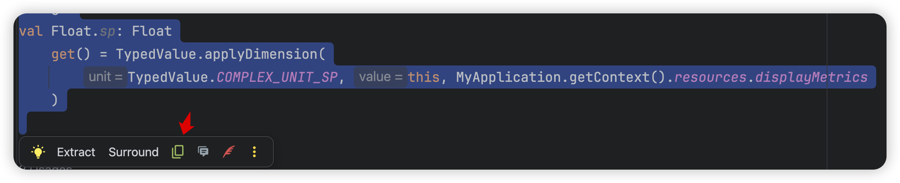
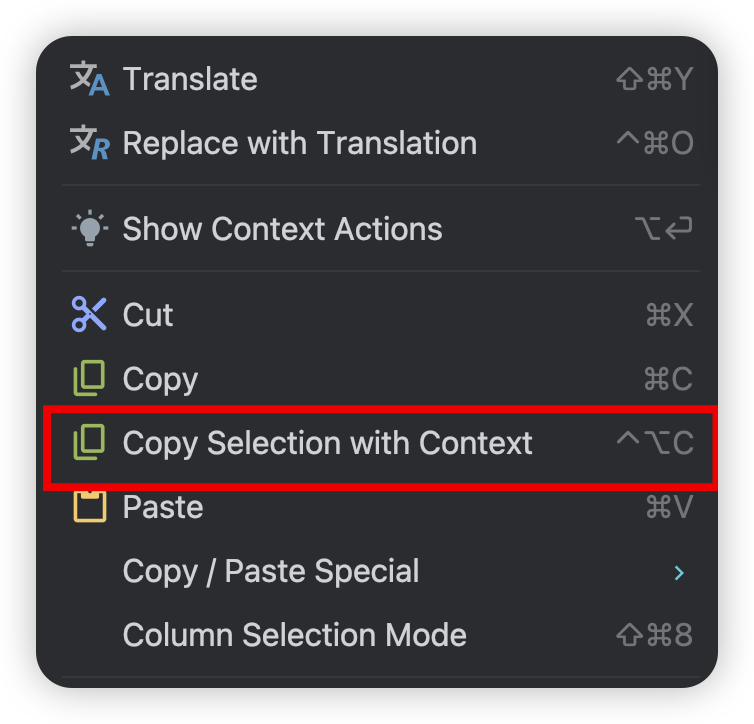

# Code2Prompt

一个 Android Studio / IntelliJ Platform 插件：将选中的代码连同文件、行号和所在符号位置，一键复制为适合发送给 AI Coding Agent 的上下文。

## 功能

- 选中代码后，在浮动代码工具栏点击复制图标。
- 编辑器右键菜单提供 **Copy Selection with Context**。
- 默认快捷键：`⌥⌘C`（macOS）。
- 自动识别 Kotlin / Java 的文件路径、选中行号和类/函数位置。





## 复制结果

````md
[HeaderModel.kt](/Users/wayne/work/android-recopos/tool/src/main/java/com/shulin/tool/network/HeaderModel.kt)  行号: 129 位置: HeaderModel#getLanguage 关键代码:
```kt
fun getLanguage(key: String): String = languageMmkv.getString(key, LanguageUtil.getLanguage()) ?: ""
```

要做什么:
````

多行选区会输出行号范围，例如 `129-135`。

## 本地安装

1. 执行 `./gradlew buildPlugin`。
2. 在 Android Studio 打开 **Settings → Plugins → ⚙ → Install Plugin from Disk…**。
3. 选择 `build/distributions/` 下生成的 ZIP 文件，并重启 IDE。

## 本地开发

当前工程直接使用本机 Android Studio 作为 IntelliJ Platform 依赖。若 Android Studio 不在默认 macOS 安装位置，请修改 `gradle.properties` 中的 `platformPath` 与 `org.gradle.java.home`。

```bash
./gradlew test buildPlugin
```
